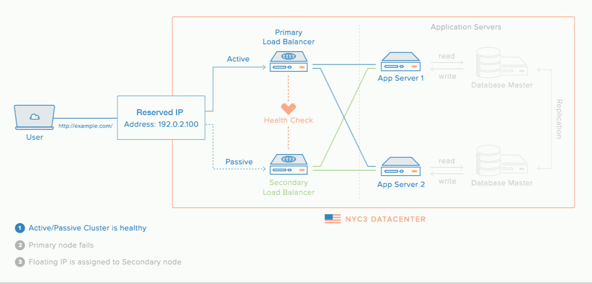

# High Availability and Automatic Failover Cloud Infrastructure.
-------------------------------------------------------------
## Flow

A user over the internet will hit the website url. The domain points to a reserved/floating IP that always transitions between the primary and secondary load balancers. 

There are basically two clusters. Active and Passive Clusters. The Active Cluster contains the Primary Load Balancer and Application Servers. The Passive Cluster contains the Secondary Load Balancer and the same Application Servers as the Active Cluster. The reserved IP initially points to the Primary Load Balancer. Custom scripts are constantly run on the primary and secondary load balancers for health checks. When the primary load balancer is unavailable or not healthy, the reserved IP automatically switches to the secondary load balancer. Once the primary load balancer is back up, the reserved IP once again switches back to the primary load balancer.

Each Load Balancer is configured with HAProxy. HAProxy is a free and open source software that provides a high availability load balancer and reverse proxy for TCP and HTTP-based applications that spreads requests across multiple servers. In each HAProxy, forwards traffic via port 5000 forwards to the API of one of the App Web Servers using the basic Round Robin Algorithm. Traffic via port 3000 forwards to the frontend of one of the App Web Servers using Round Robin Algorithm. 

Each Load Balancer is Configured with Keepalived. Keepalived implements a set of health checkers to dynamically and adaptively maintain and manage load-balanced server pools according to their health. Keepalived works hand in hand with HAProxy to make sure traffic is routed to healthy and active web servers.

Each web server is configured with Nginx and has a website and API URL linked to them. There is the main database server and a backup database server. The DB servers run on Postgresql and are in sync through Database Replication Technique.

-------------------------------------------------------------
## Infrastructure Overview

-------------------------------------------------------------
## Resources Description
### Load balancers
- Primary Load balancer  
[Configuration file](https://github.com/divinirakiza/cloud-config/blob/main/load-balancers/primary-load-balancer.md)

| Droplet   |      Value   |
|----------|:-------------:|
| Name |  load-balancer-1-main-api-ubuntu-22-04 |
| VPC  | NY3 |
| RAM |    1GB  |
| CPU |    1 AMD vCPU  |
| Memory |    25GB  |
| OS | Ubuntu 22.04 (LTS) x64 |
| Public IPv4 |    159.203.71.181  |
| Private IPv6 |    10.108.0.5   |

- Secondary Load Balancer 
[Configuration file](https://github.com/divinirakiza/cloud-config/blob/main/load-balancers/secondary-load-balancer.md)

| Droplet   |      Value   |
|----------|:-------------:|
| Name |  load-balancer-2-main-api-ubuntu-22-04 |
| VPC  | NY3 |
| RAM |    1GB  |
| CPU |    1 AMD vCPU  |
| Memory |    25GB  |
| OS | Ubuntu 22.04 (LTS) x64 |
| Public IPv4 |    134.122.10.33  |
| Private IPv6 |    10.108.0.6   |

-------------------------------------------------------------

### Web servers
- Web server 1 
[Configuration file](https://github.com/divinirakiza/cloud-config/blob/main/web-servers/web-server-1.md)

| Droplet   |      Value   |
|----------|:-------------:|
| Name |  web-server-1-main-api-ubuntu-22-04 |
| VPC  | NY3 |
| RAM |    4GB  |
| CPU |    2 AMD vCPUs  |
| Memory |    25GB  |
| OS | Ubuntu 22.04 (LTS) x64 |
| Public IPv4 |    174.138.49.168  |
| Private IPv6 |    10.108.0.2 |

- Web server 2  
[Configuration file](https://github.com/divinirakiza/cloud-config/blob/main/web-servers/web-server-1.md)

| Droplet   |      Value   |
|----------|:-------------:|
| Name |  web-server-2-main-api-ubuntu-22-04 |
| VPC  | NY3 |
| RAM |    4GB  |
| CPU |    2 AMD vCPUs  |
| Memory |    25GB  |
| OS | Ubuntu 22.04 (LTS) x64 |
| Public IPv4 |    167.71.90.114  |
| Private IPv6 |    10.108.0.3 |

-------------------------------------------------------------
### Database servers
- Master databaser server  
[Configuration file](https://github.com/divinirakiza/cloud-config/blob/main/database-servers/master-database-server.md)

| Droplet   |      Value   |
|----------|:-------------:|
| Name |  db-server-1-main-api-ubuntu-22-04 |
| VPC  | NY3 |
| RAM |    1GB  |
| CPU |    1 AMD vCPU  |
| Memory |    25GB  |
| OS | Ubuntu 22.04 (LTS) x64 |
| Public IPv4 |    159.203.105.28  |
| Private IPv6 |    10.108.0.4 |

- Backup database server  
[Configuration file](https://github.com/divinirakiza/cloud-config/blob/main/database-servers/backup-database-server.md)

| Droplet   |      Value   |
|----------|:-------------:|
| Name |  db-server-2-main-api-ubuntu-22-04 |
| VPC  | NY3 |
| RAM |    1GB  |
| CPU |    1 AMD vCPU  |
| Memory |    25GB  |
| OS | Ubuntu 22.04 (LTS) x64 |
| Public IPv4 |    159.203.169.186  |
| Private IPv6 |    10.108.0.7 |

